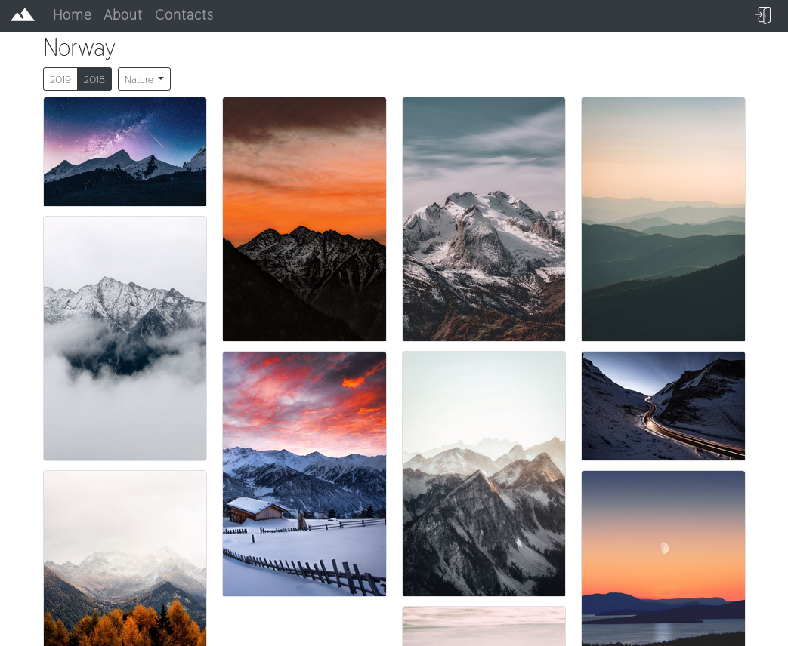

# ASP.NET Core Photo Gallery on Heroku
A photo gallery web-site on ASP.NET Core 2.2 Razor Pages, adapted for deploying on Heroku. PostgreSLQ via Entity Framework Core is used as a database, and Cloudinary is used as a file storage (with features for images resizing).

**Demo website**: <https://travelgallery.herokuapp.com/>

## Features

- images are organised in nice masonry-like columns;
- filters by year and tag are available;
- simple administration interface with support for various administrative roles;
- pages are responsive.

For deploying on Heroku I used this buildpack: https://github.com/jincod/dotnetcore-buildpack
